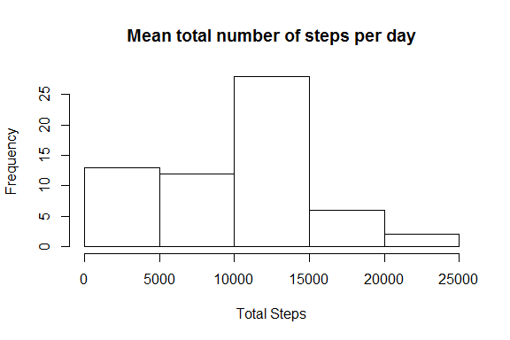
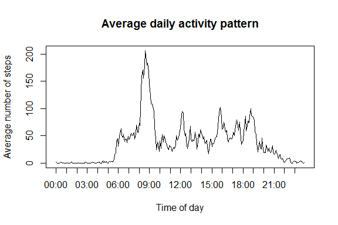
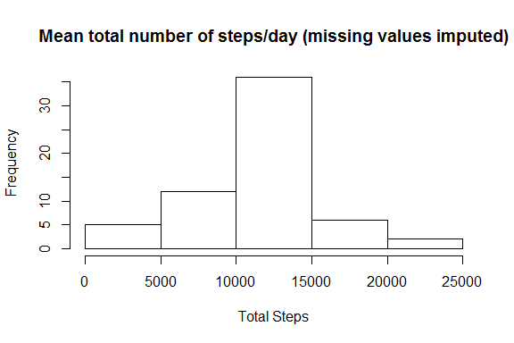
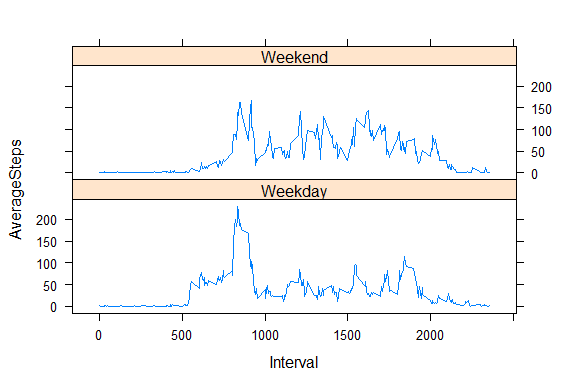

# Reproducible Research: Peer Assessment 1


## Loading and preprocessing the data

If the file is not in the working directory, download it. Then unzip, read into R, and preprocess. Load any libraries that will be used.


```r
if (!file.exists("activity.zip")) {
  url <- "https://d396qusza40orc.cloudfront.net/repdata%2Fdata%2Factivity.zip"
  download.file(url,"activity.zip")
}
unzip("activity.zip")
activity <- read.csv("activity.csv")
activity$date <- as.Date(activity$date)
library(lattice)
```

## What is mean total number of steps taken per day?

Calculate total number of steps taken each day (ignoring missing values), make a histogram, and calculate their mean and median.


```r
total <- aggregate(activity$steps, list(activity$date), sum, na.rm=T)
names(total) <- c("Date", "TotalSteps")
hist(total$TotalSteps, main="Mean total number of steps per day", xlab="Total Steps")
```

 

```r
mean(total$TotalSteps, na.rm=T)
```

```
## [1] 9354.23
```

```r
median(total$TotalSteps, na.rm=T)
```

```
## [1] 10395
```


## What is the average daily activity pattern?

Make a time series plot of the 5-minute interval and the average number of steps taken, averaged across all days.


```r
AveByInt <- aggregate(activity$steps, list(activity$interval), mean, na.rm=T)
names(AveByInt) <- c("Interval", "AverageSteps")
hour <- AveByInt$Interval %/% 100
min <- AveByInt$Interval %% 100
AveByInt$Interval2 <- format(strptime(paste(hour,min,sep=":"),format="%R"),"%H:%M")
AveByInt <- cbind(Num=c(1:288),AveByInt)
plot(AveByInt$Num, AveByInt$AverageSteps, type="l", xaxt="n", main="Average daily activity pattern", xlab="Time of day", ylab="Average number of steps")
axis(1, at=seq(1,288,12), labels=AveByInt$Interval2[seq(1,288,12)])
```

 

Identify the 5-minute interval that contains the maximum (averaged across all days) number of steps.


```r
AveByInt$Interval[which.max(AveByInt$AverageSteps)]
```

```
## [1] 835
```

```r
AveByInt$Interval2[which.max(AveByInt$AverageSteps)]
```

```
## [1] "08:35"
```


## Imputing missing values

Calculate the total number of missing values.


```r
sum(is.na(activity))
```

```
## [1] 2304
```

Create a new data set, where the missing values will be substituted with the average for the relevant 5-minute interval (using the AveByInt data set created earlier).


```r
missing <- is.na(activity$steps)
nmissing <- sum(missing)
imputed <- activity
for (i in 1:nrow(imputed)) {
  if (is.na(imputed$steps[i])==1) {
    imputed$steps[i] <- AveByInt$AverageSteps[AveByInt$Interval==imputed$interval[i]]
  }
}
```

Calculate and plot the total number of steps taken each day. Calculate mean and median.


```r
totalimputed <- aggregate(imputed$steps, list(imputed$date), sum)
names(totalimputed) <- c("Date", "TotalSteps")
hist(totalimputed$TotalSteps, main="Mean total number of steps/day (missing values imputed)", xlab="Total Steps")
```

 

```r
mean(totalimputed$TotalSteps, na.rm=T)
```

```
## [1] 10766.19
```

```r
median(totalimputed$TotalSteps, na.rm=T)
```

```
## [1] 10766.19
```

The distribution and mean/median have changed. Before imputing days with all missing values had a total of 0 steps, so the distribution was more left skewed, and mean/median were lower. Imputing missing values made the distribution more normal, with mean equal to median.


## Are there differences in activity patterns between weekdays and weekends?

Create a factor "weekday"/"weekend" in the dataset (one with imputed values). Using a time series plot, compare average daily activity over weekdays vs. weekend.


```r
imputed$weekday <- ifelse(weekdays(imputed$date)=="Saturday"|weekdays(imputed$date)=="Sunday",c("Weekend"), c("Weekday"))
AveByWeekday <- aggregate(imputed$steps, list(imputed$interval,imputed$weekday),mean, na.rm=T)
names(AveByWeekday) <- c("Interval", "Weekday", "AverageSteps")
xyplot(AverageSteps ~ Interval | Weekday, data = AveByWeekday, type="l", layout=c(1,2))
```

 


